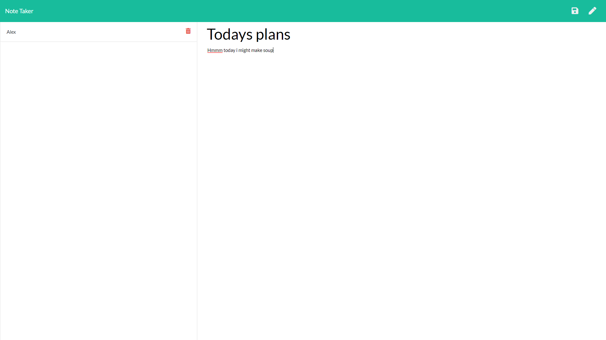

# NoteTaker
A program that can be used to log notes, the functionallity of the project includes creating, viewing and deleting notes.
The app is ran off an express server and deplyed on heroki, the github repo for the code can be acessed [here](https://github.com/Alex-Waite/NoteTaker) and the deployed app can be accessed [here](https://secret-mountain-73457.herokuapp.com)

## Usage
The user should first click _get started_
The the user will be on the notes page, here they can write a not and click on the _save_ icon to save their note
they can click on the _pen_ icon to create a new note
they can click on the _bin_ icon to delete a note
and they may click between their notes to view them

## Contact
If you have any questions or would like to report any bugs you can contact me at alexanderconorwaite@gmail.com

[Find me on linkedIn!](https://www.linkedin.com/in/alexander-waite-005165199/) 
  

